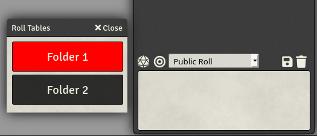
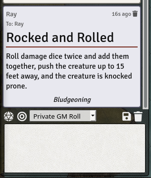

## Roll Table Buttons

* **Author:** RaySSharma#4736
* **Version:** 0.3.0
* **Foundry VTT Compatibility:** 0.4.4+
* **Module Requirement(s):** None
* **Module Conflicts:** None
* **Translation Support**: en

### Link to Module
* [https://github.com/RaySSharma/foundry-modules/tree/master/rolltable-buttons](https://github.com/RaySSharma/foundry-modules/tree/master/rolltable-buttons)
* [https://raw.githubusercontent.com/RaySSharma/foundry-modules/master/rolltable-buttons/rolltable-buttons/module.json](https://raw.githubusercontent.com/RaySSharma/foundry-modules/master/rolltable-buttons/rolltable-buttons/module.json)

### Description

This module makes it more convenient to roll from existing roll-tables.
- Adds a button to the chat to access a list of roll-tables
- Takes into account `rollMode` to allow global or private roll-table results.
- Roll-tables only appear in the list if "Display in Chat" is checked
- JournalEntry results come with a custom chat-card. 

### Installation

#### Method 1
- Download the .zip file in this repository.
- Extract the contents of the zip to your dataPath, `/Data/modules/`
- Restart Foundry.

#### Method 2
- Start up Foundry and click "Install Module" in the "Add-On Modules" tab.
- Paste the link: `https://raw.githubusercontent.com/RaySSharma/foundry-modules/master/rolltable-buttons/rolltable-buttons/module.json`
- Click "Install" and it should appear in your modules list.

### Updates
**0.0.1**
- Added buttons to Token scene controls for rolling all available rolltables.

**0.0.2**
- Moved button to chat controls.
- Added dialog box with rolltables, roll-able on click.
- Added handling of different rolltable entry-types.
    - Text and JournalEntry entries now have a custom chat card
    - All other entry-types use the default rolltable chat output.
- Added en localization (pretty minimal).

**0.1.0**
- Added handling for empty roll tables
- Added checks for user permission to view tables

**0.2.0**
- Changed Hook for chat button to `canvasReady`.
- Changed button style.
- Trimmed excess CSS.
- Added check for user GM status to show table buttons.

**0.3.0**
- Refactored code to use more FoundryVTT terminology.
- Made use of `rollMode` dropdown menu to determine whether chat message is global, GM-only, etc.
- Added check for whether "Display in Chat" is marked in the rollTable form. Table button does not appear in the RTB Dialog if "Display in Chat" is not marked.

### License
The source code is licensed under GPL-3.0.
